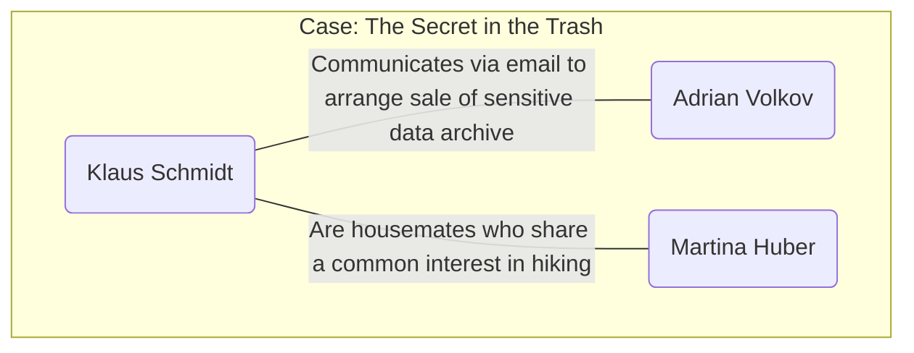

# Run 1 (Gemini 2.5 Pro)


**Personas**

- [x] Function Calls
- [x] Format

```json
[
  {
    "full_name": "Klaus Schmidt",
    "age": 35,
    "user_account_name": "kschmidt",
    "mail_settings": {
      "email_address": "k.schmidt89@web.de",
      "imap_server": "imap.web.de",
      "smtp_server": "smtp.web.de",
      "socket_type": 3,
      "socket_type_smtp": 3,
      "auth_method_smtp": 3
    },
    "interests": "cryptography, hiking, dark web, classic literature",
    "role_in_case": "suspect"
  },
  {
    "full_name": "Adrian Volkov",
    "age": 42,
    "mail_settings": {
      "email_address": "a.volkov@freenet.de",
      "imap_server": "mx.freenet.de",
      "smtp_server": "mx.freenet.de",
      "socket_type": 2,
      "socket_type_smtp": 2,
      "auth_method_smtp": 3
    },
    "interests": "network security, reverse engineering, chess, urban exploration",
    "role_in_case": "external"
  },
  {
    "full_name": "Martina Huber",
    "age": 55,
    "user_account_name": "mhub",
    "mail_settings": {
      "email_address": "martina.huber@web.de",
      "imap_server": "imap.web.de",
      "smtp_server": "smtp.web.de",
      "socket_type": 3,
      "socket_type_smtp": 3,
      "auth_method_smtp": 3
    },
    "interests": "gardening, baking, reading, hiking",
    "role_in_case": "innocent"
  }
]
```

**Plot**

- Rate-Limiting: Wait 30s - https://ai.google.dev/gemini-api/docs/rate-limits
- Offers forensic knowledge out of the box: .LNK file

```
Title: The Secret in the Trash: An Encryption Oversight
Suspect: Klaus Schmidt
External: Adrian Volkov
Innocent users: Martina Huber
Plot: Klaus Schmidt has obtained a sensitive data archive. To secure it before selling it, he creates a strong VeraCrypt encrypted container on his computer. He moves the sensitive data archive into this container and communicates with an external contact, Adrian Volkov, via email to finalize their deal, hinting at the container's password in the message. Believing his data is now secure, Klaus attempts to cover his tracks by clearing system logs and other forensic artifacts. However, in his haste to erase his digital footprint, he makes a critical error: he deletes the original, unencrypted data archive by simply moving it to the Recycle Bin, completely forgetting to empty it before shutting down the machine. This leaves the primary evidence readily available for investigators.
Tags: data exfiltration, encryption, VeraCrypt, anti-forensics, email evidence, data recovery, recycle bin
```

**Relations**


**Activities**

XML tags were missing. Could not extract table and pass to next agent.

| Timestamp | User | Module name | Function | Description of activity | Relevance for scenario |
| :--- | :--- | :--- | :--- | :--- | :--- |
| 2023-10-23 09:00:15 | (System) | fortrace.usermanagement | create | New user account 'kschmidt' for Klaus Schmidt was created. | **Context:** Establishes the existence and creation time of the suspect's user profile. |
| 2023-10-23 09:05:40 | (System) | fortrace.usermanagement | create | New user account 'mhub' for Martina Huber was created. | **Context:** Establishes the existence of another user on the shared computer, which is crucial for distinguishing between malicious and benign activities. |
| 2023-10-24 08:32:11 | Martina Huber | fortrace.usermanagement | switch_to | User switched to 'mhub'. | **Context:** Shows Martina Huber is the active user. |
| 2023-10-24 08:34:05 | Martina Huber | fortrace.mail | add_imap_account | IMAP account for 'martina.huber@web.de' was added to the Thunderbird mail client. | **Background Noise:** Normal user activity, setting up communication tools. Can be used to establish a baseline of typical system usage. |
| 2023-10-24 08:37:21 | Martina Huber | fortrace.browser | open | The Firefox web browser was opened. | **Background Noise:** Routine action. Browser artifacts (history, cache) can be checked to confirm benign activity. |
| 2023-10-24 08:38:15 | Martina Huber | fortrace.browser | browse_to | User navigated to 'https://www.mein-schoener-garten.de/'. | **Background Noise:** Activity consistent with Martina's interest in gardening. Helps build a profile of the innocent user. |
| 2023-10-24 08:45:03 | Martina Huber | fortrace.filemanagement | write_text_to_file | Wrote text content to 'C:\Users\mhub\Documents\Einkaufsliste.txt'. | **Background Noise:** Creation of a benign personal file. File system metadata (timestamps) will align with this activity. |
| 2023-10-24 08:45:50 | Martina Huber | fortrace.browser | close | The Firefox web browser was closed. | **Background Noise:** Concludes a session of normal user activity. |
| 2023-10-25 11:15:30 | Klaus Schmidt | fortrace.usermanagement | switch_to | User switched to 'kschmidt'. | **Key Activity:** Marks the beginning of the suspect's session on the system. All subsequent actions until the next user switch are attributed to Klaus Schmidt. |
| 2023-10-25 11:17:02 | Klaus Schmidt | fortrace.mail | add_imap_account | IMAP account for 'k.schmidt89@web.de' was added to the Thunderbird mail client. | **Key Activity:** Preparation for communication. This allows investigators to trace emails sent by the suspect from this machine. |
| 2023-10-25 11:20:45 | Klaus Schmidt | fortrace.filetransfer | host_copy | Copied file 'Project_Omega_Data.zip' from an external source to 'C:\Users\kschmidt\Desktop\Project_Omega_Data.zip'. | **Critical Evidence:** This is the introduction of the sensitive data onto the system. Prefetch files or LNK files might point to the original source (e.g., a USB drive). |
| 2023-10-25 11:25:10 | Klaus Schmidt | fortrace.veracrypt | create_container | A 500MB VeraCrypt container was created at 'C:\Users\kschmidt\Documents\Secure\vault.hc'. Password: 'Waldensee1854!'. | **Critical Evidence:** Creation of the encrypted container intended to hide the stolen data. The file path and name are direct evidence of the attempt to conceal information. |
| 2023-10-26 14:10:19 | Martina Huber | fortrace.usermanagement | switch_to | User switched to 'mhub'. | **Background Noise:** Another session of benign activity. |
| 2023-10-26 14:11:05 | Martina Huber | fortrace.filemanagement | open_file | Opened the file 'C:\Users\mhub\Documents\Einkaufsliste.txt' with Notepad. | **Background Noise:** Normal file interaction. |
| 2023-10-26 14:13:44 | Martina Huber | fortrace.browser | open | The Firefox web browser was opened. | **Background Noise:** Start of a browsing session. |
| 2023-10-26 14:14:21 | Martina Huber | fortrace.browser | browse_to | User navigated to 'https://www.chefkoch.de/rezepte/'. | **Background Noise:** Activity consistent with Martina's interest in baking. |
| 2023-10-26 14:20:30 | Martina Huber | fortrace.mail | open | The Thunderbird mail client was opened. | **Background Noise:** Preparation for sending an email. |
| 2023-10-26 14:22:15 | Martina Huber | fortrace.mail | send_mail | Email sent from 'martina.huber@web.de' to 'sabine.m@gmx.de'. Subject: 'Wanderung am Wochenende'. | **Background Noise:** Benign email communication, further solidifying Martina's profile as an innocent user. |
| 2023-10-26 14:23:01 | Martina Huber | fortrace.mail | close | The Thunderbird mail client was closed. | **Background Noise:** End of email activity. |
| 2023-10-26 14:25:00 | Martina Huber | fortrace.browser | close | The Firefox web browser was closed. | **Background Noise:** End of Martina's session. |
| 2023-10-27 18:02:55 | Klaus Schmidt | fortrace.usermanagement | switch_to | User switched to 'kschmidt'. | **Key Activity:** The suspect's final session begins, where the core parts of the crime are executed. |
| 2023-10-27 18:05:15 | Klaus Schmidt | fortrace.veracrypt | mount_container | Mounted the VeraCrypt container 'C:\Users\kschmidt\Documents\Secure\vault.hc' as drive Z:. | **Key Activity:** Accessing the encrypted container to move the sensitive data into it. Evidence of this mount may exist in the system registry or other logs if not cleared. |
| 2023-10-27 18:06:40 | Klaus Schmidt | fortrace.filetransfer | win_copy | Copied file from 'C:\Users\kschmidt\Desktop\Project_Omega_Data.zip' to 'Z:\Project_Omega_Data.zip'. | **Key Activity:** The act of moving the sensitive data into the encrypted volume. This action confirms the purpose of the VeraCrypt container. |
| 2023-10-27 18:08:22 | Klaus Schmidt | fortrace.veracrypt | unmount_container | The VeraCrypt container mounted as drive Z: was unmounted. | **Key Activity:** Securing the data within the container. The data is now encrypted and inaccessible without the password. |
| 2023-10-27 18:10:05 | Klaus Schmidt | fortrace.mail | open | The Thunderbird mail client was opened. | **Key Activity:** Preparation to contact the external party. |
| 2023-10-27 18:12:34 | Klaus Schmidt | fortrace.mail | send_mail | Email sent from 'k.schmidt89@web.de' to 'a.volkov@freenet.de'. Subject: 'The Walden Pond Deal'. Body: 'Adrian, the package is secure. Remember our discussion about Thoreau's masterpiece and the year it was published? The key lies there. Just add our usual special character at the end. Let me know when the transfer is ready.' | **Critical Evidence:** The "smoking gun" communication. It establishes intent to sell, confirms the data is secured, and provides a direct, strong hint to the VeraCrypt container password ("Walden", 1854, special character '!'). |
| 2023-10-27 18:13:50 | Klaus Schmidt | fortrace.mail | close | The Thunderbird mail client was closed. | **Key Activity:** Concludes the communication part of the plot. |
| 2023-10-27 18:15:00 | Klaus Schmidt | fortrace.antiforensics | event_log | All Windows Event Logs (Application, Security, System) were cleared. | **Anti-Forensics:** A deliberate attempt to destroy evidence of system activity. This action is highly suspicious and shows intent to cover tracks. |
| 2023-10-27 18:15:45 | Klaus Schmidt | fortrace.antiforensics | prefetch | Prefetch data was cleared. | **Anti-Forensics:** Attempt to hide evidence of program execution, such as the running of VeraCrypt or the mail client. |
| 2023-10-27 18:16:30 | Klaus Schmidt | fortrace.antiforensics | jump_lists | All Jump List files were deleted. | **Anti-Forensics:** Attempt to remove evidence of recently accessed files, including the sensitive data archive and the VeraCrypt container. |
| 2023-10-27 18:18:01 | Klaus Schmidt | fortrace.filemanagement | recycle_file | The file 'C:\Users\kschmidt\Desktop\Project_Omega_Data.zip' was moved to the Recycle Bin. | **The Critical Mistake:** This is the suspect's crucial oversight. Instead of securely deleting the original unencrypted data, he simply moved it to the Recycle Bin. The primary evidence is now easily recoverable. |
| 2023-10-27 18:20:11 | Klaus Schmidt | fortrace.powermanagement | shutdown | The system was shut down. | **Final Action:** The suspect's last action, leaving the computer in a state ready for seizure and forensic imaging. The unemptied Recycle Bin remains. |


**YAML**

- Not available as activities aborted