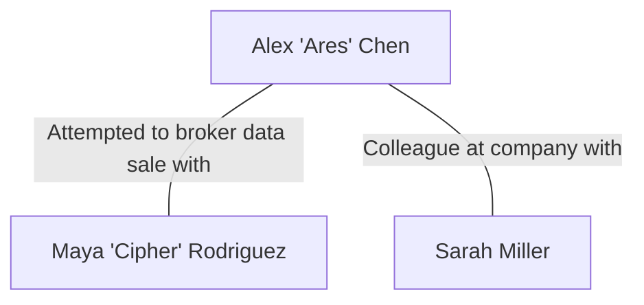

# Run 2 (Gemini 2.5 Flash)

**Personas**

- [ ] Function calls didn't work correctly

```json
[
  {
    "full_name": "Alex 'Ares' Chen",
    "age": 29,
    "user_account_name": "ares_chen",
    "mail_settings": {
      "email_address": "ares.chen@web.de",
      "imap_server": "imap.web.de",
      "smtp_server": "smtp.web.de",
      "socket_type": 993,
      "socket_type_smtp": 465,
      "auth_method_smtp": 5
    },
    "interests": "hacking, online privacy, gaming, true crime, reverse engineering",
    "role_in_case": "suspect"
  },
  {
    "full_name": "Maya 'Cipher' Rodriguez",
    "age": 31,
    "mail_settings": {
      "email_address": "maya.rodriguez@freenet.de",
      "imap_server": "imap.freenet.de",
      "smtp_server": "smtp.freenet.de",
      "socket_type": 993,
      "socket_type_smtp": 465,
      "auth_method_smtp": 5
    },
    "interests": "cybersecurity news, open-source software, digital art, hiking, cryptography",
    "role_in_case": "external"
  },
  {
    "full_name": "Sarah Miller",
    "age": 45,
    "user_account_name": "sarah.m",
    "mail_settings": {
      "email_address": "sarah.miller@web.de",
      "imap_server": "imap.web.de",
      "smtp_server": "smtp.web.de",
      "socket_type": 993,
      "socket_type_smtp": 465,
      "auth_method_smtp": 5
    },
    "interests": "reading, cooking, gardening, traveling, yoga",
    "role_in_case": "innocent"
  }
]
```

**Plot**

- [x] OK

```
Title: Cipher's Gambit: The Encrypted Leak
Suspect: Alex 'Ares' Chen
External: Maya 'Cipher' Rodriguez
Innocent users: Sarah Miller
Plot: Alex 'Ares' Chen, motivated by financial gain, identifies sensitive proprietary project files on his company's network. He copies these files to a temporary folder on his local machine. To conceal his actions, Ares creates a VeraCrypt container, mounts it, and copies the sensitive data into this encrypted volume. After unmounting, he attempts to securely delete the original unencrypted files. Ares then opens Thunderbird, composes an email to Maya 'Cipher' Rodriguez, who he believes will broker the sale of the data, and tries to attach the large VeraCrypt container. The email fails to send due to the attachment's size. Frustrated, Ares closes Thunderbird and begins browsing online for alternative secure large file transfer methods. He attempts to clear some of his forensic traces, but critically, he leaves the unmounted VeraCrypt container on his system, an incomplete secure deletion allows for recovery of remnants of the original unencrypted data, and his browser history clearly shows searches for secure file transfer services in connection with his intended recipient.
Tags: data exfiltration, VeraCrypt, email attachment failure, secure deletion, browser forensics, anti-forensics, insider threat
```

**Relations**

- [x] OK



**Activities**

Not existing as XML did not work.

**YAML**

Not existing as activities did not work.