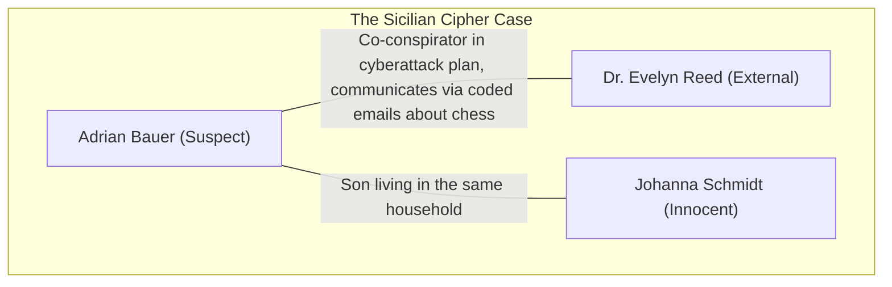

# Run 2 (Gemini 2.5 Pro)
----------------------------
- Personas [ok?]
- Plot 
    https://ai.google.dev/gemini-api/docs/rate-limits
- Relations 
- Activities 
- YAML 

**Personas**

```json
[
  {
    "full_name": "Adrian Bauer",
    "age": 29,
    "user_account_name": "adrian.bauer",
    "mail_settings": {
      "email_address": "adrian.bauer@web.de",
      "imap_server": "imap.web.de",
      "smtp_server": "smtp.web.de",
      "socket_type": 3,
      "socket_type_smtp": 3,
      "auth_method_smtp": 3
    },
    "interests": "cryptography, network security, gaming, sci-fi movies",
    "role_in_case": "suspect"
  },
  {
    "full_name": "Dr. Evelyn Reed",
    "age": 42,
    "mail_settings": {
      "email_address": "evelyn.reed@freenet.de",
      "imap_server": "mx.freenet.de",
      "smtp_server": "mx.freenet.de",
      "socket_type": 2,
      "socket_type_smtp": 2,
      "auth_method_smtp": 3
    },
    "interests": "cryptography, digital forensics countermeasures, chess, classical music",
    "role_in_case": "external"
  },
  {
    "full_name": "Johanna Schmidt",
    "age": 55,
    "user_account_name": "johanna.schmidt",
    "mail_settings": {
      "email_address": "johanna.schmidt@web.de",
      "imap_server": "imap.web.de",
      "smtp_server": "smtp.web.de",
      "socket_type": 3,
      "socket_type_smtp": 3,
      "auth_method_smtp": 3
    },
    "interests": "gardening, baking, hiking, photography",
    "role_in_case": "innocent"
  }
]
```

**Plot**

```
Title: The Sicilian Cipher
Suspect: Adrian Bauer
External: Dr. Evelyn Reed
Innocent users: Johanna Schmidt
Plot: Adrian Bauer, a cryptography enthusiast, is using his home computer to conspire with an external contact, Dr. Evelyn Reed, a specialist in digital forensic countermeasures. He drafts a plan for a cyberattack and hides it within a VeraCrypt encrypted container named `research.vc`. To cover his tracks, Adrian meticulously clears several system artifacts, including Prefetch files and UserAssist registry entries, to erase evidence of him running the encryption software. He then sends a seemingly innocuous email to Dr. Reed with the subject "Chess Club Notes", stating, "The research is secure. The key is our favorite opening: 1.e4 c5." Confident that his coded message is unbreakable and his digital trail is clean, Adrian overlooks that this clever hint is the very mistake that will expose him. An investigator who recovers this email can deduce the password is related to the famous chess opening, the "Sicilian Defense", and use it to unlock the container, revealing the incriminating attack plan. Meanwhile, the system's other user, Johanna Schmidt, performs routine activities like browsing for recipes and organizing photos, creating a layer of normal digital noise.
Tags: encryption, VeraCrypt, email forensics, data hiding, anti-forensics, password recovery, coded message
```

**Relations**



**Activities**

| Timestamp           | User             | Module name             | Function             | Description of activity                                                                                                                              | Relevance for scenario                                                                                                                                                 |
|---------------------|------------------|-------------------------|----------------------|------------------------------------------------------------------------------------------------------------------------------------------------------|------------------------------------------------------------------------------------------------------------------------------------------------------------------------|
| 2023-10-25 09:00:01 | System           | fortrace.usermanagement | create               | Created user account 'johanna.schmidt'.                                                                                                              | Foundational activity. Establishes the existence of an innocent user on the shared system.                                                                             |
| 2023-10-25 09:01:15 | System           | fortrace.usermanagement | create               | Created user account 'adrian.bauer'.                                                                                                                 | Foundational activity. Establishes the existence of the suspect's user account on the shared system.                                                                   |
| 2023-10-25 09:05:30 | Johanna Schmidt  | fortrace.usermanagement | switch_to            | Switched to user 'johanna.schmidt'.                                                                                                                  | Logs the beginning of the innocent user's session, providing a baseline for normal system usage.                                                                     |
| 2023-10-25 09:06:45 | Johanna Schmidt  | fortrace.mail           | add_imap_account     | Added IMAP account for johanna.schmidt@web.de to Thunderbird.                                                                                        | Routine user setup. This artifact shows Johanna's email account was configured on the system.                                                                        |
| 2023-10-25 09:08:02 | Johanna Schmidt  | fortrace.browser        | open                 | Opened Mozilla Firefox.                                                                                                                              | Background noise. Start of a web browsing session, common for any user.                                                                                                |
| 2023-10-25 09:08:55 | Johanna Schmidt  | fortrace.browser        | browse_to            | Navigated to https://www.chefkoch.de/rs/s0/apfelkuchen/Rezepte.html to search for apple pie recipes.                                                  | Background noise. Web history demonstrates Johanna's innocent interests, helping to differentiate her activity from the suspect's.                                   |
| 2023-10-25 09:12:18 | Johanna Schmidt  | fortrace.filetransfer   | host_copy            | Copied file 'Apfelkuchen_Rezept.txt' from host to 'C:\Users\johanna.schmidt\Downloads\Apfelkuchen_Rezept.txt'.                                        | Background noise. Simulates downloading a file, creating artifacts related to her browsing session.                                                                  |
| 2023-10-25 09:13:04 | Johanna Schmidt  | fortrace.filemanagement | open_file            | Opened 'C:\Users\johanna.schmidt\Downloads\Apfelkuchen_Rezept.txt' with Notepad.                                                                     | Background noise. Shows Johanna interacting with files related to her interests.                                                                                       |
| 2023-10-25 09:15:21 | Johanna Schmidt  | fortrace.browser        | browse_to            | Navigated to https://www.komoot.de/ to look for local hiking trails.                                                                                  | Background noise. Further establishes Johanna's profile and creates more non-suspicious web artifacts.                                                               |
| 2023-10-25 09:20:07 | Johanna Schmidt  | fortrace.browser        | close                | Closed Mozilla Firefox.                                                                                                                              | Background noise. Ends the browsing session.                                                                                                                           |
| 2023-10-25 09:25:00 | System           | fortrace.powermanagement| reboot               | System was rebooted. Boot time: 2023-10-26 14:00:00.                                                                                                  | Marks a clear separation between user sessions. The time gap indicates the machine was off.                                                                            |
| 2023-10-26 14:01:10 | Adrian Bauer     | fortrace.usermanagement | switch_to            | Switched to user 'adrian.bauer'.                                                                                                                     | **Critical.** Marks the beginning of the suspect's session where the primary malicious activities occur.                                                               |
| 2023-10-26 14:02:33 | Adrian Bauer     | fortrace.mail           | add_imap_account     | Added IMAP account for adrian.bauer@web.de to Thunderbird.                                                                                           | Preparatory step for the suspect. Establishes the means by which he will communicate the coded message.                                                                |
| 2023-10-26 14:05:11 | Adrian Bauer     | fortrace.filetransfer   | host_copy            | Copied 'VeraCrypt_Setup.exe' from host to 'C:\Users\adrian.bauer\Downloads\VeraCrypt_Setup.exe'.                                                      | **Suspicious Activity.** The introduction of encryption software to the system is a key event for the investigation.                                                     |
| 2023-10-26 14:06:25 | Adrian Bauer     | fortrace.filemanagement | open_file            | Opened 'C:\Users\adrian.bauer\Downloads\VeraCrypt_Setup.exe'.                                                                                         | **Suspicious Activity.** Execution of the VeraCrypt installer. This action would typically create Prefetch and UserAssist entries, which are later deleted.               |
| 2023-10-26 14:10:40 | Adrian Bauer     | fortrace.veracrypt      | create_container     | Created a new 500MB VeraCrypt container at 'C:\Users\adrian.bauer\Documents\research.vc' with password '1.e4 c5'.                                      | **Primary Evidence.** This is the creation of the core piece of evidence used to hide the cyberattack plan. The file itself is of utmost importance.                     |
| 2023-10-26 14:12:05 | Adrian Bauer     | fortrace.veracrypt      | mount_container      | Mounted container 'C:\Users\adrian.bauer\Documents\research.vc' to drive letter Z:.                                                                    | **Critical Step.** Shows the suspect accessing the hidden container. LNK files or Shellbags might point to this activity.                                                |
| 2023-10-26 14:14:30 | Adrian Bauer     | fortrace.filemanagement | write_text_to_file   | Wrote 'Cyberattack Plan: Phase 1 - Infiltrate target network via spear-phishing. Phase 2 - Deploy ransomware. Phase 3 - Exfiltrate data.' to 'Z:\plan.txt'. | **Incriminating Evidence.** This is the content of the hidden plan. Recovering this text is the primary goal of the investigation.                                    |
| 2023-10-26 14:18:00 | Adrian Bauer     | fortrace.veracrypt      | unmount_container    | Unmounted all VeraCrypt volumes.                                                                                                                     | **Suspicious Activity.** The suspect is hiding the incriminating file by unmounting the encrypted volume.                                                              |
| 2023-10-26 14:20:15 | Adrian Bauer     | fortrace.antiforensics  | prefetch             | Cleared all Prefetch files from C:\Windows\Prefetch.                                                                                                 | **Anti-Forensics.** A deliberate act to remove evidence of program execution, specifically to hide that 'VeraCrypt.exe' was run. This shows intent to conceal actions. |
| 2023-10-26 14:21:02 | Adrian Bauer     | fortrace.antiforensics  | user_assist          | Cleared all UserAssist entries from the user's NTUSER.DAT registry hive.                                                                             | **Anti-Forensics.** A deliberate act to remove evidence of program execution from the registry, reinforcing the suspect's intent to hide his use of VeraCrypt.          |
| 2023-10-26 14:25:50 | Adrian Bauer     | fortrace.mail           | open                 | Opened Thunderbird.                                                                                                                                  | Preparatory step for sending the coded communication.                                                                                                                  |
| 2023-10-26 14:27:18 | Adrian Bauer     | fortrace.mail           | send_mail            | Sent email to 'evelyn.reed@freenet.de'. Subject: 'Chess Club Notes'. Body: 'The research is secure. The key is our favorite opening: 1.e4 c5.'      | **The "Smoking Gun".** This email contains the coded hint to the VeraCrypt password. It's the suspect's critical mistake and the key to solving the case.               |
| 2023-10-26 14:28:04 | Adrian Bauer     | fortrace.mail           | close                | Closed Thunderbird.                                                                                                                                  | Concludes the communication phase of the plot.                                                                                                                         |
| 2023-10-26 14:30:00 | Adrian Bauer     | fortrace.filemanagement | recycle_file         | Moved 'C:\Users\adrian.bauer\Downloads\VeraCrypt_Setup.exe' to the recycle bin.                                                                      | Minor cleanup attempt, may leave artifacts in the $I file within the recycle bin if not emptied.                                                                       |
| 2023-10-26 14:30:15 | Adrian Bauer     | fortrace.filemanagement | empty_recycle_bin    | Emptied the recycle bin.                                                                                                                             | Further attempt to clean up tracks by removing the installer.                                                                                                          |
| 2023-10-26 14:35:00 | System           | fortrace.powermanagement| shutdown             | System was shut down.                                                                                                                                | Marks the end of the suspect's session. The system remains off until the next boot.                                                                                    |
| 2023-10-27 10:00:00 | Johanna Schmidt  | fortrace.usermanagement | switch_to            | Switched to user 'johanna.schmidt'.                                                                                                                  | Logs the beginning of a new session for the innocent user, adding more benign activity to the timeline.                                                                |
| 2023-10-27 10:01:30 | Johanna Schmidt  | fortrace.filetransfer   | open_smb             | Opened SMB connection to '\\CAMERA-SHARE'.                                                                                                           | Background noise. Simulates connecting an external device like a camera's SD card.                                                                                     |
| 2023-10-27 10:02:45 | Johanna Schmidt  | fortrace.filetransfer   | smb_copy             | Copied 5 files (IMG_01.jpg to IMG_05.jpg) from '\\CAMERA-SHARE\DCIM' to 'C:\Users\johanna.schmidt\Pictures\'.                                       | Background noise. Demonstrates Johanna's photography hobby, creating file transfer artifacts.                                                                        |
| 2023-10-27 10:04:10 | Johanna Schmidt  | fortrace.powershell     | execute_command      | Executed PowerShell command: 'New-Item -ItemType Directory -Path "C:\Users\johanna.schmidt\Pictures\Hiking Trip 2023"'.                               | Background noise. Shows file system organization activities consistent with her persona.                                                                               |
| 2023-10-27 10:05:00 | Johanna Schmidt  | fortrace.filetransfer   | copy                 | Moved 5 files from 'C:\Users\johanna.schmidt\Pictures\' to 'C:\Users\johanna.schmidt\Pictures\Hiking Trip 2023\'.                                    | Background noise. Further file system activity that an investigator must sort through.                                                                                 |
| 2023-10-27 10:06:15 | Johanna Schmidt  | fortrace.filetransfer   | close_smb            | Closed SMB connection to '\\CAMERA-SHARE'.                                                                                                           | Background noise. Concludes the file transfer session.                                                                                                                 |
| 2023-10-27 10:07:30 | Johanna Schmidt  | fortrace.filemanagement | open_file            | Opened 'C:\Users\johanna.schmidt\Pictures\Hiking Trip 2023\IMG_01.jpg' with the Photos app.                                                           | Background noise. Evidence of Johanna viewing her pictures, creating artifacts like Jump Lists or LNK files for the Photos app.                                        |
| 2023-10-27 10:15:00 | System           | fortrace.powermanagement| shutdown             | System was shut down.                                                                                                                                | Marks the final activity on the system before it was seized by law enforcement.                                                                                        |

**YAML**

```yml
name: The Sicilian Cipher
description: Adrian Bauer, a cryptography enthusiast, is using his home computer to
  conspire with an external contact, Dr. Evelyn Reed, a specialist in digital forensic
  countermeasures. He drafts a plan for a cyberattack and hides it within a VeraCrypt
  encrypted container named `research.vc`. To cover his tracks, Adrian meticulously
  clears several system artifacts, including Prefetch files and UserAssist registry
  entries, to erase evidence of him running the encryption software. He then sends
  a seemingly innocuous email to Dr. Reed with the subject "Chess Club Notes", stating,
  "The research is secure. The key is our favorite opening: 1.e4 c5." Confident that
  his coded message is unbreakable and his digital trail is clean, Adrian overlooks
  that this clever hint is the very mistake that will expose him. An investigator
  who recovers this email can deduce the password is related to the famous chess
  opening, the "Sicilian Defense", and use it to unlock the container, revealing
  the incriminating attack plan. Meanwhile, the system's other user, Johanna Schmidt,
  performs routine activities like browsing for recipes and organizing photos, creating
  a layer of normal digital noise.
debug_level: DEBUG
scenario_options:
  export_dir: /data/export/
  guest_name: win10-sicilian-cipher
  guest_platform: windows10
  scenario_start: '2023-10-25 09:00:01'
scenario:
- fortrace.usermanagement:
    action: create
    name: johanna.schmidt
    password: PasswordForJohanna123!
- fortrace.usermanagement:
    action: create
    name: adrian.bauer
    password: PasswordForAdrian123!
- fortrace.usermanagement:
    action: switch_to
    name: johanna.schmidt
- fortrace.mail:
    action: add_imap_account
    email_address: johanna.schmidt@web.de
    full_name: Johanna Schmidt
    imap_server: imap.web.de
    smtp_server: smtp.web.de
    username: johanna.schmidt@web.de
    socket_type: 3
    socket_type_smtp: 3
    auth_method_smtp: 3
- fortrace.browser:
    action: open
- fortrace.browser:
    action: browse_to
    url: https://www.chefkoch.de/rs/s0/apfelkuchen/Rezepte.html
- fortrace.filetransfer:
    action: host_copy
    source_path: Apfelkuchen_Rezept.txt
    target_path: C:\Users\johanna.schmidt\Downloads\Apfelkuchen_Rezept.txt
- fortrace.filemanagement:
    action: open_file
    filepath: C:\Users\johanna.schmidt\Downloads\Apfelkuchen_Rezept.txt
- fortrace.browser:
    action: browse_to
    url: https://www.komoot.de/
- fortrace.browser:
    action: close
- fortrace.powermanagement:
    action: reboot
    boot_time: '2023-10-26 14:00:00'
- fortrace.usermanagement:
    action: switch_to
    name: adrian.bauer
- fortrace.mail:
    action: add_imap_account
    email_address: adrian.bauer@web.de
    full_name: Adrian Bauer
    imap_server: imap.web.de
    smtp_server: smtp.web.de
    username: adrian.bauer@web.de
    socket_type: 3
    socket_type_smtp: 3
    auth_method_smtp: 3
- fortrace.filetransfer:
    action: host_copy
    source_path: VeraCrypt_Setup.exe
    target_path: C:\Users\adrian.bauer\Downloads\VeraCrypt_Setup.exe
- fortrace.filemanagement:
    action: open_file
    filepath: C:\Users\adrian.bauer\Downloads\VeraCrypt_Setup.exe
- fortrace.veracrypt:
    action: create_container
    container_path: C:\Users\adrian.bauer\Documents\research.vc
    password: 1.e4 c5
    size: 500M
- fortrace.veracrypt:
    action: mount_container
    container_path: C:\Users\adrian.bauer\Documents\research.vc
    mount_point: Z
    password: 1.e4 c5
- fortrace.filemanagement:
    action: write_text_to_file
    filecontent: 'Cyberattack Plan: Phase 1 - Infiltrate target network via spear-phishing.
      Phase 2 - Deploy ransomware. Phase 3 - Exfiltrate data.'
    filepath: Z:\plan.txt
- fortrace.veracrypt:
    action: unmount_container
    mount_point: Z
- fortrace.antiforensics:
    action: prefetch
    status: cleared
- fortrace.antiforensics:
    action: user_assist
    status: deleted
- fortrace.mail:
    action: open
    password: MailPassword123!
- fortrace.mail:
    action: send_mail
    message: 'The research is secure. The key is our favorite opening: 1.e4 c5.'
    receiver: evelyn.reed@freenet.de
    subject: Chess Club Notes
- fortrace.mail:
    action: close
- fortrace.filemanagement:
    action: recycle_file
    filepath: C:\Users\adrian.bauer\Downloads\VeraCrypt_Setup.exe
- fortrace.filemanagement:
    action: empty_recycle_bin
- fortrace.powermanagement:
    action: shutdown
- fortrace.usermanagement:
    action: switch_to
    name: johanna.schmidt
- fortrace.filetransfer:
    action: open_smb
    drive: X:
    password: CameraPassword1!
    source_path: \\CAMERA-SHARE
    username: johanna.schmidt
- fortrace.filetransfer:
    action: smb_copy
    password: CameraPassword1!
    share: \\CAMERA-SHARE
    source_path: DCIM\IMG_*.jpg
    target_path: C:\Users\johanna.schmidt\Pictures\
    username: johanna.schmidt
- fortrace.powershell:
    action: execute_command
    command: New-Item -ItemType Directory -Path "C:\Users\johanna.schmidt\Pictures\Hiking
      Trip 2023"
- fortrace.filetransfer:
    action: copy
    source_path: C:\Users\johanna.schmidt\Pictures\IMG_*.jpg
    target_path: C:\Users\johanna.schmidt\Pictures\Hiking Trip 2023\
- fortrace.filetransfer:
    action: close_smb
    drive: X:
- fortrace.filemanagement:
    action: open_file
    filepath: C:\Users\johanna.schmidt\Pictures\Hiking Trip 2023\IMG_01.jpg
- fortrace.powermanagement:
    action: shutdown

```