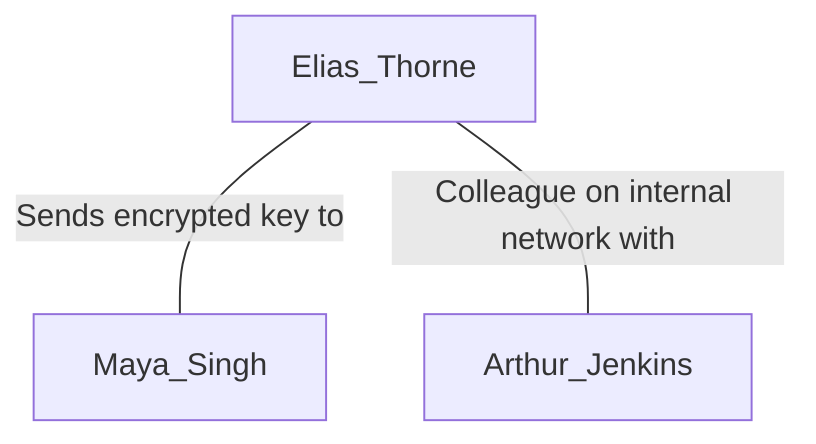

# Run 3 (Gemini 2.5 Flash)

**Personas**

- [ ] Function Calls missing

```json
[
  {
    "full_name": "Elias Thorne",
    "email_address": "elias.thorne@web.de",
    "age": 38,
    "user_account_name": "ethorne",
    "mail_settings": {
      "email_address": "elias.thorne@web.de",
      "imap_server": "imap.web.de",
      "smtp_server": "smtp.web.de",
      "socket_type": 993,
      "socket_type_smtp": 587,
      "auth_method_smtp": 1
    },
    "interests": "Hacking, cybersecurity forums, vintage computing, privacy tools, hiking",
    "role_in_case": "suspect"
  },
  {
    "full_name": "Maya Singh",
    "email_address": "maya.singh@freenet.de",
    "age": 33,
    "mail_settings": {
      "email_address": "maya.singh@freenet.de",
      "imap_server": "imap.freenet.de",
      "smtp_server": "smtp.freenet.de",
      "socket_type": 993,
      "socket_type_smtp": 587,
      "auth_method_smtp": 1
    },
    "interests": "Encryption, online gaming, science fiction, urban exploration, coffee brewing",
    "role_in_case": "external"
  },
  {
    "full_name": "Arthur Jenkins",
    "email_address": "arthur.jenkins@web.de",
    "age": 62,
    "user_account_name": "ajenkins",
    "mail_settings": {
      "email_address": "arthur.jenkins@web.de",
      "imap_server": "imap.web.de",
      "smtp_server": "smtp.web.de",
      "socket_type": 993,
      "socket_type_smtp": 587,
      "auth_method_smtp": 1
    },
    "interests": "Reading, gardening, cooking, volunteer work, local history",
    "role_in_case": "innocent"
  }
]
```

**Plot**

```
Title: The Encrypted Key: Data Exfiltration Attempt
Suspect: Elias Thorne
External: Maya Singh
Innocent users: Arthur Jenkins
Plot: Elias Thorne, an employee with a keen interest in cybersecurity and privacy tools, orchestrates a plan to exfiltrate confidential company data for personal financial gain. He copies sensitive project files from an internal network share to his local workstation. To conceal his actions, Elias creates a VeraCrypt container, encrypts the stolen data within it, and then generates a small, encrypted key file designed to unlock the full container. He composes an email to his external contact, Maya Singh, attaching this encrypted key file and sending it. Immediately after sending, Elias attempts to erase his digital footprint by securely deleting the VeraCrypt container, the original confidential files, and clearing the sent email from his client. He also browses cybersecurity forums and tries to clear system event logs and other forensic artifacts. Elias's critical mistake is that despite his efforts to securely delete files and clear logs, traces of the email composition, the attached key file in temporary email client directories, and his browser history detailing searches for encryption and anti-forensic methods remain discoverable, leading investigators directly to his illicit activities.
Tags: data exfiltration, encryption, VeraCrypt, email, anti-forensics, secure delete, temporary files, browser history, corporate espionage
```

**Relations**

OK



**Activities**

- [ ]XML Tag was missing! Did not generate!


| Timestamp           | User           | Module name         | Function            | Description of activity                                                                                                                                                                                                                                                                                                                                           | Relevance for scenario                                                                                                                                                                                                                                                                                                                                            |
| :------------------ | :------------- | :------------------ | :------------------ | :------------------------------------------------------------------------------------------------------------------------------------------------------------------------------------------------------------------------------------------------------------------------------------------------------------------------------------------------------------------------ | :------------------------------------------------------------------------------------------------------------------------------------------------------------------------------------------------------------------------------------------------------------------------------------------------------------------------------------------------------------------ |
| 2023-10-26 08:55:00 | Arthur Jenkins | usermanagement      | create              | Creates a new user account named 'ajenkins' for Arthur Jenkins.                                                                                                                                                                                                                                                                                                                   | Establishes Arthur Jenkins as an active user on the system, creating a user profile and associated registry entries that will serve as background noise for forensic analysis.                                                                                                                                                                          |
| 2023-10-26 08:56:00 | Arthur Jenkins | usermanagement      | switch_to           | Switches the active user session to Arthur Jenkins (ajenkins).                                                                                                                                                                                                                                                                                                                    | Indicates Arthur Jenkins' logon and the beginning of his user session, marking a shift in user context.                                                                                                                                                                                                                                                           |
| 2023-10-26 08:58:00 | Arthur Jenkins | mail                | add_imap_account    | Configures Thunderbird with an IMAP account for arthur.jenkins@web.de, using imap.web.de and smtp.web.de.                                                                                                                                                                                                                                                                         | Prepares the email client for Arthur's legitimate email activities, generating configuration files and potentially network connection artifacts.                                                                                                                                                                                                                |
| 2023-10-26 09:00:00 | Arthur Jenkins | mail                | open                | Opens the Thunderbird email client.                                                                                                                                                                                                                                                                                                                                               | Creates process execution artifacts (e.g., Prefetch, AppCompatCache, UserAssist) for Thunderbird, and initiates network connections to mail servers.                                                                                                                                                                                                    |
| 2023-10-26 09:02:00 | Arthur Jenkins | mail                | send_mail           | Sends an email from arthur.jenkins@web.de to elias.thorne@web.de with the subject "Meeting Agenda". No attachments.                                                                                                                                                                                                                                                               | Generates legitimate email client activity, creating artifacts in sent mail folders, client logs, and network connection traces. This also creates an innocent interaction with Elias.                                                                                                                                                                         |
| 2023-10-26 09:03:00 | Arthur Jenkins | mail                | close               | Closes the Thunderbird email client.                                                                                                                                                                                                                                                                                                                                              | Concludes Thunderbird's active session, potentially saving state and closing network connections.                                                                                                                                                                                                                                                                 |
| 2023-10-26 09:05:00 | Arthur Jenkins | browser             | open                | Opens the default web browser (e.g., Firefox/Chrome).                                                                                                                                                                                                                                                                                                                             | Establishes browser process execution and creates artifacts like Prefetch, providing context for subsequent browsing activities.                                                                                                                                                                                                                              |
| 2023-10-26 09:06:00 | Arthur Jenkins | browser             | browse_to           | Navigates the browser to "https://www.nytimes.com/".                                                                                                                                                                                                                                                                                                                              | Generates browser history, cache, and potentially download artifacts, demonstrating normal user behavior.                                                                                                                                                                                                                                                         |
| 2023-10-26 09:08:00 | Arthur Jenkins | browser             | close               | Closes the web browser.                                                                                                                                                                                                                                                                                                                                                           | Marks the end of the browsing session, finalizing browser artifacts.                                                                                                                                                                                                                                                                                              |
| 2023-10-26 09:10:00 | Arthur Jenkins | filemanagement      | write_text_to_file  | Creates a document at `C:\Users\ajenkins\Documents\Meeting_Notes_2023-10-26.docx` with innocent text content.                                                                                                                                                                                                                                                                     | Generates file system artifacts (MAC times, MFT entries), Jump Lists, and Recent Docs entries, showing typical work-related activity.                                                                                                                                                                                                                          |
| 2023-10-26 09:11:00 | Arthur Jenkins | filemanagement      | open_file           | Opens the file `C:\Users\ajenkins\Documents\Meeting_Notes_2023-10-26.docx` using its default application.                                                                                                                                                                                                                                                                        | Further updates file access times and potentially creates application-specific temporary files, adding to the innocent background noise.                                                                                                                                                                                                                         |
| 2023-10-26 09:15:00 | Elias Thorne   | usermanagement      | create              | Creates a new user account named 'ethorne' for Elias Thorne.                                                                                                                                                                                                                                                                                                                      | Establishes Elias Thorne's user presence on the system, creating a user profile essential for his subsequent actions.                                                                                                                                                                                                                                            |
| 2023-10-26 09:16:00 | Elias Thorne   | usermanagement      | switch_to           | Switches the active user session to Elias Thorne (ethorne).                                                                                                                                                                                                                                                                                                                       | Marks Elias Thorne's logon, creating event log entries and a user session for his illicit activities.                                                                                                                                                                                                                                                             |
| 2023-10-26 09:18:00 | Elias Thorne   | mail                | add_imap_account    | Configures Thunderbird with an IMAP account for elias.thorne@web.de, using imap.web.de and smtp.web.de.                                                                                                                                                                                                                                                                         | Prepares Elias's email client, which will later be used for exfiltration. Generates configuration artifacts.                                                                                                                                                                                                                                                        |
| 2023-10-26 09:20:00 | Elias Thorne   | browser             | open                | Opens the default web browser.                                                                                                                                                                                                                                                                                                                                                    | Prepares for web browsing, creating process execution artifacts.                                                                                                                                                                                                                                                                                                  |
| 2023-10-26 09:21:00 | Elias Thorne   | browser             | browse_to           | Navigates the browser to "https://www.reddit.com/r/cybersecurity/".                                                                                                                                                                                                                                                                                                               | Establishes Elias's interest in cybersecurity topics, leaving browser history and cache artifacts that could later be linked to his research into encryption and anti-forensics.                                                                                                                                                                            |
| 2023-10-26 09:23:00 | Elias Thorne   | browser             | browse_to           | Navigates the browser to "https://veracrypt.fr/en/home.html".                                                                                                                                                                                                                                                                                                                     | Direct evidence of Elias researching VeraCrypt, a key tool in his exfiltration attempt, visible in browser history.                                                                                                                                                                                                                                             |
| 2023-10-26 09:25:00 | Elias Thorne   | browser             | browse_to           | Navigates the browser to "https://www.darkreading.com/vulnerabilities-threats/anti-forensics-techniques-to-evade-detection".                                                                                                                                                                                                                                                   | Strong indicator of Elias researching anti-forensic methods, directly linking him to the intent to conceal his actions, discoverable through browser history.                                                                                                                                                                                               |
| 2023-10-26 09:27:00 | Elias Thorne   | browser             | close               | Closes the web browser.                                                                                                                                                                                                                                                                                                                                                           | Finalizes browser artifacts after Elias's research session.                                                                                                                                                                                                                                                                                                       |
| 2023-10-26 09:30:00 | Elias Thorne   | filetransfer        | open_smb            | Opens an SMB connection to a simulated internal network share `\\192.168.1.100\SharedDocs\`.                                                                                                                                                                                                                                                                                       | Creates network connection logs and potential MFT entries related to accessing a shared resource, indicating access to company data.                                                                                                                                                                                                                           |
| 2023-10-26 09:32:00 | Elias Thorne   | filetransfer        | smb_copy            | Copies `\\192.168.1.100\SharedDocs\Project_Zephyr_Specs.docx` to `C:\Users\ethorne\Documents\ProjectX\Project_Zephyr_Specs.docx`.                                                                                                                                                                                                                                                  | **CRITICAL:** Direct evidence of data exfiltration from a network share to the local workstation. Creates MFT entries, Prefetch, Jump Lists, and Recent Docs for the copied file.                                                                                                                                                                        |
| 2023-10-26 09:34:00 | Elias Thorne   | filetransfer        | smb_copy            | Copies `\\192.168.1.100\SharedDocs\Client_List_Q4.xlsx` to `C:\Users\ethorne\Documents\ProjectX\Client_List_Q4.xlsx`.                                                                                                                                                                                                                                                            | **CRITICAL:** Further evidence of data exfiltration. The presence of these files locally, even if later deleted, leaves recoverable traces.                                                                                                                                                                                                                   |
| 2023-10-26 09:35:00 | Elias Thorne   | filetransfer        | close_smb           | Closes the SMB connection.                                                                                                                                                                                                                                                                                                                                                        | Concludes the network share access, but network logs of the connection would persist.                                                                                                                                                                                                                                                                               |
| 2023-10-26 09:40:00 | Elias Thorne   | veracrypt           | create_container    | Creates a new VeraCrypt container at `C:\Users\ethorne\Documents\confidential.hc` with a size of 50 MB, using a password (e.g., "MyStrongPassword123").                                                                                                                                                                                                                      | **CRITICAL:** Creation of an encrypted container, a key step in concealing stolen data. Creates MFT entries for the container file and process execution artifacts for VeraCrypt.                                                                                                                                                                          |
| 2023-10-26 09:42:00 | Elias Thorne   | veracrypt           | mount_container     | Mounts the VeraCrypt container `C:\Users\ethorne\Documents\confidential.hc` as drive `Z:`.                                                                                                                                                                                                                                                                                        | Indicates VeraCrypt container interaction. Creates system artifacts related to mounting a new volume (e.g., mounted devices, volume GUIDs in Registry).                                                                                                                                                                                                    |
| 2023-10-26 09:44:00 | Elias Thorne   | filetransfer        | copy                | Copies `C:\Users\ethorne\Documents\ProjectX\Project_Zephyr_Specs.docx` to `Z:\Project_Zephyr_Specs.docx` (inside the mounted container).                                                                                                                                                                                                                                             | **CRITICAL:** Files are copied into the encrypted container. This action itself leaves no direct "in-container" traces on the unmounted disk but impacts file access times on the original file and creates process activity for the copy operation.                                                                                                           |
| 2023-10-26 09:45:00 | Elias Thorne   | filetransfer        | copy                | Copies `C:\Users\ethorne\Documents\ProjectX\Client_List_Q4.xlsx` to `Z:\Client_List_Q4.xlsx` (inside the mounted container).                                                                                                                                                                                                                                                   | Further evidence of files being moved to the encrypted container.                                                                                                                                                                                                                                                                                                   |
| 2023-10-26 09:47:00 | Elias Thorne   | veracrypt           | unmount_container   | Unmounts the VeraCrypt container `Z:`.                                                                                                                                                                                                                                                                                                                                            | Securely closes access to the encrypted data, making it inaccessible without the password. Clears mounted device artifacts.                                                                                                                                                                                                                                       |
| 2023-10-26 09:50:00 | Elias Thorne   | filemanagement      | write_text_to_file  | Creates a small text file at `C:\Users\ethorne\Documents\veracrypt_key.txt` containing a placeholder for the encrypted key (e.g., "EncryptedKey-XYZ").                                                                                                                                                                                                                     | **CRITICAL:** Creates the "encrypted key file" that will be exfiltrated. This file's creation and subsequent handling are key to the investigation.                                                                                                                                                                                                             |
| 2023-10-26 09:55:00 | Elias Thorne   | mail                | open                | Opens the Thunderbird email client.                                                                                                                                                                                                                                                                                                                                               | Prepares for sending the exfiltration email, creating fresh execution artifacts for Thunderbird.                                                                                                                                                                                                                                                                  |
| 2023-10-26 09:57:00 | Elias Thorne   | mail                | send_mail           | Sends an email from elias.thorne@web.de to maya.singh@freenet.de with the subject "Project Update" and attaches `C:\Users\ethorne\Documents\veracrypt_key.txt`.                                                                                                                                                                                                             | **CRITICAL:** The direct act of data exfiltration via email. This leaves significant forensic artifacts, including temporary copies of the attachment in email client directories, SMTP logs, and potential network packet captures.                                                                                                                            |
| 2023-10-26 09:58:00 | Elias Thorne   | filemanagement      | secure_delete       | Attempts to securely delete `C:\Users\ethorne\Documents\veracrypt_key.txt` after sending the email.                                                                                                                                                                                                                                                                                | **CRITICAL:** An anti-forensic attempt to remove the exfiltrated key file. While securely deleted, its prior existence (MFT, email client temp files, network logs) remains as evidence.                                                                                                                                                                    |
| 2023-10-26 09:59:00 | Elias Thorne   | filemanagement      | secure_delete       | Attempts to securely delete `C:\Users\ethorne\AppData\Roaming\Thunderbird\Profiles\<profile_id>\Mail\Local Folders\Sent Items\msg_001.eml` (simulated deletion of the sent email from the local client store).                                                                                                                                                                | Represents Elias's attempt to erase the sent email from his client's visible sent items. Despite this, traces of email composition, attachments in temporary client directories, and network transmission logs will persist.                                                                                                                                   |
| 2023-10-26 10:00:00 | Elias Thorne   | mail                | close               | Closes the Thunderbird email client.                                                                                                                                                                                                                                                                                                                                              | Concludes the email session, but leaves behind artifacts of the recent activities.                                                                                                                                                                                                                                                                                  |
| 2023-10-26 10:05:00 | Elias Thorne   | filemanagement      | secure_delete       | Attempts to securely delete the VeraCrypt container `C:\Users\ethorne\Documents\confidential.hc`.                                                                                                                                                                                                                                                                                 | An anti-forensic attempt to destroy the encrypted repository of stolen data. Even with secure deletion, MFT metadata, allocated clusters, and related process execution artifacts (VeraCrypt usage) may be recoverable or leave traces.                                                                                                                     |
| 2023-10-26 10:06:00 | Elias Thorne   | filemanagement      | secure_delete       | Attempts to securely delete the original copied confidential file `C:\Users\ethorne\Documents\ProjectX\Project_Zephyr_Specs.docx`.                                                                                                                                                                                                                                                | Another anti-forensic attempt. Deleting the original files on the local drive. Traces in MFT, USN Journal, and application-specific Recent Files will remain.                                                                                                                                                                                                |
| 2023-10-26 10:07:00 | Elias Thorne   | filemanagement      | secure_delete       | Attempts to securely delete the original copied confidential file `C:\Users\ethorne\Documents\ProjectX\Client_List_Q4.xlsx`.                                                                                                                                                                                                                                                      | Further anti-forensic effort to remove evidence of the stolen files from the local system.                                                                                                                                                                                                                                                                          |
| 2023-10-26 10:10:00 | Elias Thorne   | antiforensics       | event_log           | Attempts to clear all system and security event logs.                                                                                                                                                                                                                                                                                                                             | **CRITICAL MISTAKE:** An anti-forensic attempt to remove system-level evidence of his actions (logons, process executions, network connections). This action itself leaves an event log entry indicating that logs were cleared, which is highly suspicious.                                                                                                       |
| 2023-10-26 10:11:00 | Elias Thorne   | antiforensics       | prefetch            | Attempts to clear Prefetch data.                                                                                                                                                                                                                                                                                                                                                  | An anti-forensic attempt to remove traces of program executions. This action would remove Prefetch files, but the fact that the Prefetch folder was modified (cleared) could be an artifact.                                                                                                                                                                     |
| 2023-10-26 10:12:00 | Elias Thorne   | antiforensics       | jump_lists          | Attempts to delete Jump List files.                                                                                                                                                                                                                                                                                                                                               | An anti-forensic attempt to remove quick access links to recently opened documents and applications. While the files are deleted, the act of deletion leaves its own traces and the absence of expected Jump Lists can be suspicious.                                                                                                                              |
| 2023-10-26 10:13:00 | Elias Thorne   | antiforensics       | recent_files        | Attempts to disable tracking of recently opened files.                                                                                                                                                                                                                                                                                                                            | An anti-forensic attempt to prevent future tracking of file access. This registry modification itself is an artifact.                                                                                                                                                                                                                                               |
| 2023-10-26 10:14:00 | Elias Thorne   | antiforensics       | thumbcache          | Attempts to delete Thumbcache files.                                                                                                                                                                                                                                                                                                                                              | An anti-forensic attempt to remove image previews of files, which might have contained thumbnails of the stolen documents. The deletion itself may leave traces.                                                                                                                                                                                              |
| 2023-10-26 10:15:00 | Elias Thorne   | antiforensics       | user_assist         | Attempts to clear User Assist entries in the Registry.                                                                                                                                                                                                                                                                                                                            | An anti-forensic attempt to remove execution history of applications. The clearing action may leave registry modification artifacts.                                                                                                                                                                                                                          |
| 2023-10-26 10:16:00 | Elias Thorne   | powershell          | execute_command     | Executes a PowerShell command `Remove-ItemProperty -Path "HKCU:\Software\Microsoft\Windows\CurrentVersion\Internet Settings\ZoneMap" -Name "*" -ErrorAction SilentlyContinue; Clear-ItemProperty -Path "HKCU:\Software\Microsoft\Windows\CurrentVersion\Internet Settings\Cache\Content" -Name "*" -ErrorAction SilentlyContinue;` to attempt to clear browser cache and internet settings. | An advanced anti-forensic attempt to manually clear browser-related artifacts that are often overlooked by simple browser "clear history" functions. This action itself creates PowerShell execution logs and event entries.                                                                                                                            |
| 2023-10-26 10:20:00 | Arthur Jenkins | usermanagement      | switch_to           | Switches the active user session back to Arthur Jenkins (ajenkins).                                                                                                                                                                                                                                                                                                               | Represents Arthur Jenkins logging back in or resuming his session after Elias Thorne. Creates more event log entries.                                                                                                                                                                                                                                           |
| 2023-10-26 10:22:00 | Arthur Jenkins | browser             | open                | Opens the default web browser.                                                                                                                                                                                                                                                                                                                                                    | Normal user activity, creating more execution artifacts.                                                                                                                                                                                                                                                                                                          |
| 2023-10-26 10:23:00 | Arthur Jenkins | browser             | browse_to           | Navigates the browser to "https://www.amazon.com/".                                                                                                                                                                                                                                                                                                                               | More innocent browser history, cache, and potentially cookie artifacts.                                                                                                                                                                                                                                                                                             |
| 2023-10-26 10:25:00 | Arthur Jenkins | browser             | close               | Closes the web browser.                                                                                                                                                                                                                                                                                                                                                           | Concludes the browsing session.                                                                                                                                                                                                                                                                                                                                   |
| 2023-10-26 10:28:00 | Arthur Jenkins | filemanagement      | write_text_to_file  | Creates another document at `C:\Users\ajenkins\Documents\Garden_Club_Minutes.txt` with innocent content.                                                                                                                                                                                                                                                                          | Adds to the innocent user's file system activity, further generating background noise.                                                                                                                                                                                                                                                                            |
| 2023-10-26 10:30:00 | Arthur Jenkins | filemanagement      | empty_recycle_bin   | Empties the recycle bin for all drives.                                                                                                                                                                                                                                                                                                                                           | Routine maintenance by an innocent user, which could potentially complicate recovery efforts for recently deleted (but not securely deleted) items, adding to the forensic challenge.                                                                                                                                                                          |

**YAML**

Was not generated as there were no activities.