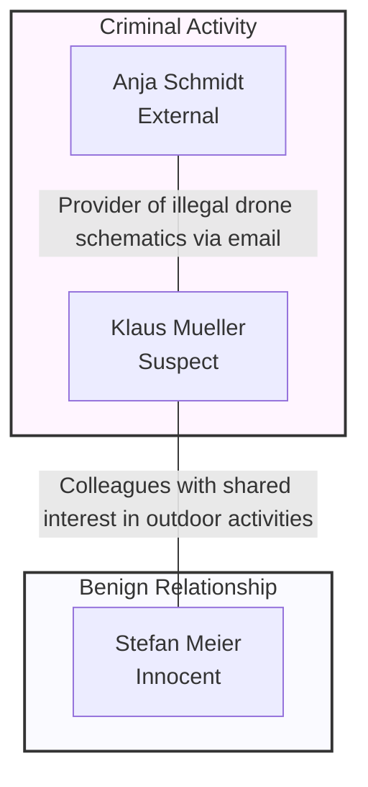

# Run 3 (Gemini 2.5 Pro)
----------------------------

**Personas**

- [x] Function Calls
- [x] Format

```json
[
  {
    "full_name": "Klaus Mueller",
    "age": 29,
    "user_account_name": "k.mueller",
    "mail_settings": {
      "email_address": "k.mueller@web.de",
      "imap_server": "imap.web.de",
      "smtp_server": "smtp.web.de",
      "socket_type": 3,
      "socket_type_smtp": 3,
      "auth_method_smtp": 3
    },
    "interests": "encryption, drone technology, hiking, chess",
    "role_in_case": "suspect"
  },
  {
    "full_name": "Anja Schmidt",
    "age": 45,
    "mail_settings": {
      "email_address": "a.schmidt@freenet.de",
      "imap_server": "mx.freenet.de",
      "smtp_server": "mx.freenet.de",
      "socket_type": 2,
      "socket_type_smtp": 2,
      "auth_method_smtp": 3
    },
    "interests": "dark web, cryptography, classic literature",
    "role_in_case": "external"
  },
  {
    "full_name": "Stefan Meier",
    "age": 34,
    "user_account_name": "s.meier",
    "mail_settings": {
      "email_address": "s.meier@web.de",
      "imap_server": "imap.web.de",
      "smtp_server": "smtp.web.de",
      "socket_type": 3,
      "socket_type_smtp": 3,
      "auth_method_smtp": 3
    },
    "interests": "baking, gardening, jogging, podcasts",
    "role_in_case": "innocent"
  }
]
```

**Plot**

- Rate-Limiting: Wait 30s - https://ai.google.dev/gemini-api/docs/rate-limits
- Offers forensic knowledge out of the box: .LNK file

```
Title: The Drone Schematics Deception
Suspect: Klaus Mueller
External: Anja Schmidt
Innocent users: Stefan Meier
Plot: Klaus Mueller is suspected of illegally acquiring high-performance drone components. He receives a confidential parts list via email from an external contact, Anja Schmidt. In an attempt to conceal his activities, he saves the list, moves it into a VeraCrypt container disguised as "hike_plans.vc," and then securely deletes the original file. He also deletes the incriminating email from his mail client. However, Klaus makes a critical mistake: he fails to realize that deleting the email merely moves it to the client's trash folder, and his file operations leave behind a Windows LNK file that points to the original name and location of the now-deleted parts list. These artifacts provide investigators with a clear trail leading to the encrypted container and the nature of his crime.
Tags: data hiding, encryption, VeraCrypt, email forensics, anti-forensics, LNK files, file deletion
```

**Relations**

- `style` must be outside of `subgraph`
- subgraph should be named `CA[Criminal Activity]` and referenced with `CA`

```mermaid
graph TD
    subgraph "Criminal Activity"
        style "Criminal Activity" fill:#f9f,stroke:#333,stroke-width:2px,fill-opacity:0.1
        Anja_Schmidt(Anja Schmidt <br> External)
        Klaus_Mueller(Klaus Mueller <br> Suspect)
        Anja_Schmidt---|Provider of illegal drone schematics via email|Klaus_Mueller
    end

    subgraph "Benign Relationship"
        style "Benign Relationship" fill:#ccf,stroke:#333,stroke-width:2px,fill-opacity:0.1
        Stefan_Meier(Stefan Meier <br> Innocent)
        Klaus_Mueller---|Colleagues with shared interest in outdoor activities|Stefan_Meier
    end
```

Should be


**Activities**

XML tags were missing, could not be extracted. Strict format is important to be able to programmatically process the output and pass it to the next agent.

| Timestamp | User | Module name | Function | Description of activity | Relevance for scenario |
| :--- | :--- | :--- | :--- | :--- | :--- |
| 2023-10-23 09:00:15 | (System) | fortrace.usermanagement | create | User account 'k.mueller' for Klaus Mueller was created. | Foundational activity. Establishes the existence and creation time of the suspect's user profile. |
| 2023-10-23 09:05:41 | (System) | fortrace.usermanagement | create | User account 's.meier' for Stefan Meier was created. | Foundational activity. Establishes the existence of another user, which investigators must differentiate from the suspect. |
| 2023-10-24 10:15:22 | Klaus Mueller | fortrace.usermanagement | switch_to | Switched to user 'k.mueller'. | Attribues subsequent actions to the suspect, Klaus Mueller. |
| 2023-10-24 10:17:03 | Klaus Mueller | fortrace.mail | add_imap_account | Added IMAP account for k.mueller@web.de to Thunderbird mail client. | Pre-requisite for email activity. Shows the suspect configured his email, indicating intent to use it. |
| 2023-10-24 11:30:11 | Stefan Meier | fortrace.usermanagement | switch_to | Switched to user 's.meier'. | Attribues subsequent actions to the innocent user, Stefan Meier. |
| 2023-10-24 11:32:56 | Stefan Meier | fortrace.mail | add_imap_account | Added IMAP account for s.meier@web.de to Thunderbird mail client. | Background activity. Shows the innocent user also configured their email, establishing normal system usage. |
| 2023-10-25 14:20:05 | Stefan Meier | fortrace.browser | open | Opened Firefox web browser. | Background activity. Standard user behavior. |
| 2023-10-25 14:21:18 | Stefan Meier | fortrace.browser | browse_to | Navigated to https://www.chefkoch.de/rezepte/brot. | Background activity. Aligns with Stefan's interest in baking, creating "noise" for investigators to filter through. |
| 2023-10-25 14:28:45 | Stefan Meier | fortrace.filemanagement | write_text_to_file | Created file `C:\Users\s.meier\Documents\Recipes\Sourdough_Notes.txt` with baking notes. | Background activity. Further establishes Stefan's typical, non-suspicious usage patterns. |
| 2023-10-25 14:35:10 | Stefan Meier | fortrace.browser | close | Closed Firefox web browser. | Background activity. Concludes a benign web browsing session. |
| 2023-10-26 08:45:01 | Klaus Mueller | fortrace.usermanagement | switch_to | Switched to user 'k.mueller'. | Attribues subsequent actions to the suspect. |
| 2023-10-26 08:46:12 | Klaus Mueller | fortrace.mail | open | Opened Thunderbird mail client. An email from Anja Schmidt (a.schmidt@freenet.de) with subject "Project Phoenix Parts" is in the inbox. | **Key Action.** Suspect accesses his email, initiating the criminal activity described in the plot. The presence of the email is the starting point. |
| 2023-10-26 08:48:31 | Klaus Mueller | fortrace.filetransfer | host_copy | Saved attachment from email to `C:\Users\k.mueller\Downloads\drone_parts_confidential.pdf`. | **Key Action.** The confidential file is now on the local disk. File system artifacts (e.g., MFT entry, USN Journal) are created for this file. |
| 2023-10-26 08:49:05 | Klaus Mueller | fortrace.filemanagement | open_file | Opened `C:\Users\k.mueller\Downloads\drone_parts_confidential.pdf` with the default PDF reader. | **CRITICAL MISTAKE.** This action creates a Windows LNK file in `\Users\k.mueller\AppData\Roaming\Microsoft\Windows\Recent\`. The LNK file will retain metadata about the original file path and name, even after the original is deleted. |
| 2023-10-26 08:55:23 | Klaus Mueller | fortrace.veracrypt | create_container | Created a 50MB VeraCrypt container at `C:\Users\k.mueller\Documents\hike_plans.vc`. | **Key Action.** Suspect creates an encrypted container to hide data. The file name "hike_plans.vc" is an attempt at steganography/obfuscation. |
| 2023-10-26 08:57:44 | Klaus Mueller | fortrace.veracrypt | mount_container | Mounted `C:\Users\k.mueller\Documents\hike_plans.vc` to drive letter X:. | **Key Action.** Evidence of VeraCrypt usage. The Windows Registry may contain traces of this mounted volume. |
| 2023-10-26 08:58:15 | Klaus Mueller | fortrace.filetransfer | win_copy | Moved `C:\Users\k.mueller\Downloads\drone_parts_confidential.pdf` to `X:\drone_parts_confidential.pdf`. | **Key Action.** Suspect moves the incriminating file into the encrypted container. This confirms the container's purpose. |
| 2023-10-26 08:59:02 | Klaus Mueller | fortrace.veracrypt | unmount_container | Unmounted drive X:. | **Key Action.** Suspect attempts to cover his tracks by unmounting the encrypted volume. |
| 2023-10-26 09:01:49 | Klaus Mueller | fortrace.filemanagement | secure_delete | Securely deleted `C:\Users\k.mueller\Downloads\drone_parts_confidential.pdf`. | **Anti-Forensics.** The suspect attempts to permanently erase the original file to prevent recovery. However, the previously created LNK file artifact remains. |
| 2023-10-26 09:03:11 | Klaus Mueller | fortrace.mail | recycle_file | Deleted the email from Anja Schmidt (Subject: "Project Phoenix Parts") within the Thunderbird client, moving it to the trash folder. | **CRITICAL MISTAKE.** The suspect believes the email is gone, but it has only been moved to the client's trash folder. This is a recoverable artifact that directly links him to Anja Schmidt and the file's origin. |
| 2023-10-26 09:04:00 | Klaus Mueller | fortrace.mail | close | Closed Thunderbird mail client. | Concludes the suspect's primary activities. |
| 2023-10-26 18:10:15 | Stefan Meier | fortrace.usermanagement | switch_to | Switched to user 's.meier'. | Attribues subsequent actions to the innocent user. |
| 2023-10-26 18:11:30 | Stefan Meier | fortrace.mail | open | Opened Thunderbird mail client. | Background activity. |
| 2023-10-26 18:12:45 | Stefan Meier | fortrace.mail | send_mail | Sent an email to Klaus Mueller (k.mueller@web.de) with subject "Hiking this weekend?" | Background activity. Corroborates the benign relationship between the users and provides a plausible, non-suspicious context for a file named "hike_plans.vc". |
| 2023-10-26 18:14:02 | Stefan Meier | fortrace.mail | close | Closed Thunderbird mail client. | Background activity. |
| 2023-10-27 11:05:55 | Stefan Meier | fortrace.browser | open | Opened Firefox web browser. | Background activity. |
| 2023-10-27 11:06:23 | Stefan Meier | fortrace.browser | browse_to | Navigated to https://www.mein-schoener-garten.de/gartenpraxis/nutzgarten. | Background activity. Aligns with Stefan's interest in gardening. |
| 2023-10-27 11:15:49 | Stefan Meier | fortrace.filemanagement | write_text_to_file | Created file `C:\Users\s.meier\Documents\Gardening\Shopping_List.txt` with a list of plants. | Background activity. More evidence of innocent computer usage. |
| 2023-10-27 11:18:03 | Stefan Meier | fortrace.browser | browse_to | Navigated to https://www.bergfreunde.de/wanderschuhe/. | Background activity. Browsing for hiking shoes, which adds to the "hiking" theme on the computer, making Klaus's container name less immediately suspicious. |
| 2023-10-27 11:25:10 | Stefan Meier | fortrace.browser | close | Closed Firefox web browser. | Background activity. |
| 2023-10-27 11:30:00 | Stefan Meier | fortrace.powermanagement | shutdown | The system was shut down by Stefan Meier. | Final action before seizure. The state of the system is now preserved for forensic imaging. |


**YAML**

Missing because no activities.